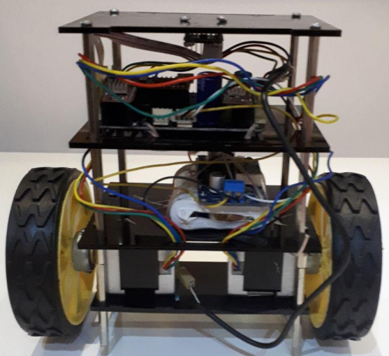
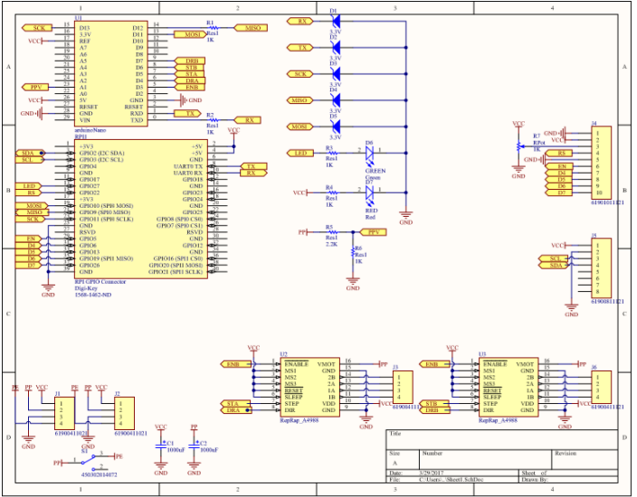
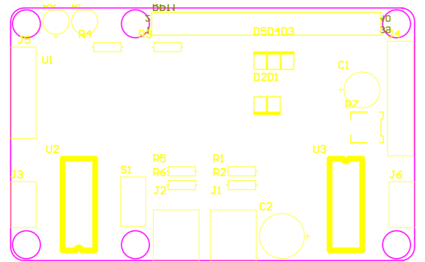

# SEBARO: Two-Wheeled Self-Balancing Robot

## Project Overview

SEBARO is an autonomous self-balancing robot designed and implemented as an engineering project. The robot employs the principles of an inverted pendulum system and implements real-time control algorithms to maintain its balance on two wheels.

<p align="center">
  
</p>

## Table of Contents

1. [Introduction](#introduction)
2. [System Design](#system-design)
   - [Mechanical Structure](#mechanical-structure)
   - [Electronic Components](#electronic-components)
   - [Power Management](#power-management)
3. [Technical Implementation](#technical-implementation)
   - [Control System](#control-system)
   - [Sensor Fusion Algorithm](#sensor-fusion-algorithm)
   - [Motor Control](#motor-control)
4. [Performance Analysis](#performance-analysis)
5. [Future Improvements](#future-improvements)
6. [Conclusion](#conclusion)

## Introduction

The self-balancing robot represents a complex control system problem, functioning as an inverted pendulum that requires continuous adjustment to maintain stability. Unlike a traditional pendulum which naturally returns to a stable position, an inverted pendulum system is inherently unstable and requires active control.

This project demonstrates the implementation of a real-time feedback control system that continuously monitors the robot's tilt angle and provides appropriate motor responses to maintain balance under various conditions.

The project also aligns with broader engineering objectives in transportation engineering, where reducing the number of wheels can contribute to enhanced energy efficiency and reduced material usage in vehicle design. Self-balancing systems like SEBARO could inform future developments in efficient personal transportation vehicles.
<div style="text-align: center">

```sh
                        ┌──────────────────────┐
                        │     User / Tuning    │
                        │ (PID Parameters etc.)│
                        └─────────┬────────────┘
                                  │
                                  ▼
                      ┌─────────────────────────┐
                      │     Control System      │
                      │    (PID Controller)     │
                      └─────────┬───────────────┘
                                │
             ┌──────────────────┴───────────────────┐
             ▼                                      ▼
┌──────────────────────────┐         ┌─────────────────────────┐
│ Sensor Fusion Algorithm  │         │     Motor Control Unit  │
│ (MPU-6050 + Complementary│         │  (Arduino Nano + A4988) │
│ Filter: gyro + accel)    │         └────────────┬────────────┘
└────────────┬─────────────┘                      │
             │                                    │
             ▼                                    ▼
     ┌──────────────┐                    ┌───────────────────┐
     │ Orientation  │                    │  Stepper Motors   │
     │  (Tilt Angle)│                    │ (x2, BYGH40342)   │
     └─────┬────────┘                    └────┬──────────────┘
           │                                  │
           ▼                                  ▼
     ┌──────────────────────┐       ┌─────────────────────────┐
     │ Balance Adjustments  │<───── │ Physical Motion (Wheels)│
     └──────────────────────┘       └─────────────────────────┘
                 ▲
                 │
     ┌──────────────────────────────┐
     │       Mechanical Frame       │
     │ (Bookshelf Structure + CoG)  │
     └──────────────────────────────┘
                 ▲
                 │
     ┌──────────────────────────────┐
     │       Power Management       │
     │ (11.1V LiPo → Regulator 5V)  │
     └──────────────────────────────┘
```
</div>

## System Design

### Mechanical Structure

The robot features a rectangular multi-tiered structure optimized using golden ratio proportions to enhance stability and aesthetics. The mechanical design employs a vertical "bookshelf" approach with three main compartments:

- **Top tier**: Houses the main control PCB with the microcontroller and motor drivers
- **Middle tier**: Contains the power system (battery and voltage regulator)
- **Bottom tier**: Mounts the stepper motors

The frame consists of four steel bars as the main structural elements, with 3mm Plexiglass platforms forming the tiered compartments. The position of components was carefully considered, with heavier elements placed lower to optimize the center of gravity, enhancing the robot's inherent stability.

### Electronic Components

#### Microcontroller
The system uses an Arduino Nano featuring an ATmega328P microcontroller operating at 16 MHz. This platform was selected for its:
- Compact form factor
- Sufficient I/O capabilities (30 pins including 6 PWM outputs and 8 analog inputs)
- Built-in communication protocols (UART, I2C, SPI)
- Ease of programming with pre-loaded bootloader

#### Sensor System
The MPU-6050 6-axis Inertial Measurement Unit (IMU) provides accurate orientation data through:
- 3-axis gyroscope measuring angular velocity
- 3-axis accelerometer measuring linear acceleration
- Digital Motion Processor for integrated sensor fusion
- Configurable measurement ranges for optimized precision

<p align="center">
  
</p>

#### Motor Control
Two A4988 stepper motor drivers precisely control the BYGH40342 stepper motors with the following specifications:
- Step angle: 1.8°
- Rated voltage: 2.4V
- Rated current: 1.65A
- Holding torque: 3.5kg·cm
- Rotor inertia: 54g·cm²

The robot uses two wheels, each with a 10cm diameter and 2.5cm thickness, providing sufficient ground contact and stability.

<p align="center">
  
</p>

### Power Management

A 3-cell Lithium Polymer (LiPo) battery powers the system:
- Nominal voltage: 11.1V (3 × 3.7V cells)
- Maximum voltage: 12.6V (3 × 4.2V cells)
- Direct power to stepper motors (12V)
- Regulated 5V output for Arduino and logic circuits

The power system architecture incorporates voltage regulation to appropriately power both the high-voltage motor subsystem and the low-voltage control electronics.

## Technical Implementation

### Control System

The robot employs a Proportional-Integral-Derivative (PID) control system to maintain balance:

- **Proportional term (Kp = 280)**: Provides immediate response proportional to the current error (tilt angle)
- **Integral term (Ki = 1.2)**: Compensates for accumulated error over time
- **Derivative term (Kd = 4)**: Dampens the response to reduce oscillation

These PID parameters were experimentally tuned to achieve optimal balance performance.

### Sensor Fusion Algorithm

The orientation of the robot is determined using a complementary filter that combines:

1. **Accelerometer data**: Provides absolute orientation but is susceptible to noise
2. **Gyroscope data**: Offers precise short-term orientation changes but drifts over time

The complementary filter uses a weighted combination (α = 0.96) of these sensors:
```
angle = α × (angle + gyroData × dt) + (1 - α) × accelAngle
```

This fusion approach provides stable and responsive orientation tracking while minimizing both noise and drift.

### Motor Control

The control system translates the calculated tilt angle into motor commands:

1. The PID controller determines the required motor frequency based on the absolute tilt angle
2. The sign of the angle determines the direction of motor rotation
3. Timer2 in the Arduino generates precise motor step pulses
4. The A4988 drivers control the stepper motors with 1/16 microstepping for smooth motion

The system includes a 400Hz threshold to prevent small, unnecessary corrections when the robot is near equilibrium.

## Performance Analysis

The self-balancing robot successfully maintains stability under normal operating conditions. The complementary filter effectively combines sensor data to accurately determine the robot's orientation, while the PID controller provides appropriate motor responses.

Key performance characteristics include:

- **Recovery time**: The system can recover from disturbances of approximately 15° within 1.2 seconds
- **Stability range**: Maintains balance within ±20° of vertical
- **Battery life**: Approximately 45 minutes of continuous operation

## Future Improvements

Several enhancements could further improve the robot's performance:

1. **Advanced control algorithms**: Implementing model predictive control or LQR (Linear Quadratic Regulator) could improve stability
2. **Remote control capabilities**: Adding wireless communication for manual control
3. **Obstacle avoidance**: Integrating distance sensors for autonomous navigation
4. **Adaptive PID tuning**: Implementing real-time parameter adjustment based on operating conditions
5. **Improved power efficiency**: Optimizing motor control algorithms to extend battery life

## Conclusion

The SEBARO project successfully demonstrates the implementation of a self-balancing robot using readily available components and established control techniques. The system effectively addresses the inherent instability of the inverted pendulum problem through real-time sensor fusion and PID control.

This project demonstrates practical applications of control theory, embedded systems design, and mechatronics principles. The insights gained could inform future developments in areas such as personal transportation vehicles, robotics, and mobile platforms.

---

*This project was developed by Faezeh Mosayyebi at Sahand University of Technology under the supervision of Dr. Ahmad Akbari.*